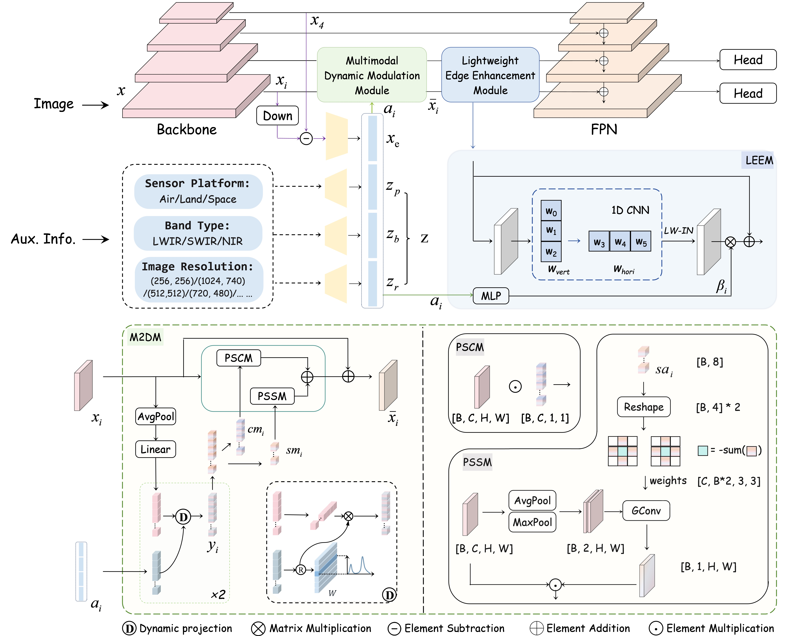

# 🪄 AuxDet: Auxiliary Metadata Matters for Omni-Domain Infrared Small Target Detection

[](https://arxiv.org/abs/2505.15184)

------

Authors: Yangting Shi, Renjie He, Le Hui, Xiang Li, Jian Yang, Ming-Ming Cheng, Yimian Dai

The official implementation of "**AuxDet: Auxiliary Metadata Matters for Omni-Domain Infrared Small Target Detection**".

------

## 🧾 Introduction

Infrared imaging plays a vital role in real-world applications such as marine resource exploration, precision guidance, and ecological monitoring, thanks to its ability to detect targets under harsh weather and low-visibility conditions.

However, **most existing work in infrared small target detection (IRSTD) focuses narrowly on domain-specific feature engineering**, while ignoring the wide-area, cross-domain detection needs of real-world infrared systems.

This has led to a serious issue: current IRSTD methods often break down when evaluated under Omni-Domain settings, where imaging conditions—such as platforms, spectral bands, and resolutions—vary significantly.


🎯 Our core research question is:
 **In Omni-Domain IRSTD, can a model recognize the imaging domain of each input and adapt accordingly?**
 Our answer is **yes**.

📡 In practical infrared sensing systems, each captured image comes with a set of **auxiliary metadata**—such as sensor platform, spectral band, and spatial resolution.

💡 While often overlooked, this metadata encodes **key factors driving the domain-specific appearance and feature distribution**. It can serve as a **compact, semantically rich descriptor** of the imaging domain.

------

## 🔍 Architecture

We propose the Auxiliary Metadata Driven Detector (AuxDet), a novel framework for Omni-IRSTD that redefines the conventional visual-only paradigm by leveraging auxiliary metadata for multi-modal scene-aware optimization.



------

## 📊 Dataset

We adopt the **[WideIRSTD-Full](https://github.com/XinyiYing/WideIRSTD-Dataset)** dataset as our evaluation benchmark. The dataset consists of 7 public datasets and an additional dataset developed by the team at the National University of Defense Technology (NUDT). It is important to note that auxiliary metadata corresponding to images is only provided in the training set. Therefore, for the training set only, we used the re-splitting provided in https://github.com/YeRen123455/ICPR-Track2-LightWeight/tree/main/dataset/ICPR_Track2/70_20 for our experiments.

------

## 🚀 Installation

### Step 1. Clone the repository

```shell
git clone https://github.com/GrokCV/AuxDet.git
cd AuxDet
```

### Step 2. Create environment and install dependencies

```shell
conda create --name AUXD python=3.9 -y
conda activate AUXD
conda install pytorch torchvision torchaudio pytorch-cuda=11.7 -c pytorch -c nvidia
pip install -U openmim
mim install mmengine  
mim install "mmcv>=2.0.0rc4,<2.2.0"
# cd AuxDet/
pip install -v -e .
```

------

## 🧊 Getting Started

First, place your dataset files according to the following folder structure.

```python
data_root
    |--VOC2007
        |-- ImageSets
            |-- Main # Following the dataset split from https://github.com/YeRen123455/ICPR-Track2-LightWeight/tree/main/dataset/ICPR_Track2/70_20
                |-- train.txt
                |-- val.txt
        |-- Annotations
            |-- 00001.xml 
            |-- 00002.xml
            |-- ...
        |-- PNGImages # Images under WideIRSTD-Full Dataset/train/images (a total of 9,000 images)
            |-- 00001.png 
            |-- 00002.png
            |-- ... 
```

Remember to update the dataset paths in the code accordingly.

```python
# Open the file: ./configs/_base_/datasets/voc_aux.py

# Update Line 2 with your dataset root directory
data_root = "your own root directory" 

# Modify Line 60 and related fields accordingly:
ann_file='VOC2007/ImageSets/Main/train.txt',  
            img_subdir="PNGImages",
            ann_subdir="Annotations",
            data_prefix=dict(sub_data_root='VOC2007/'
```

### Training

```shell
CUDA_VISIBLE_DEVICES=0 python tools/train.py configs/auxdet/auxdet_r50_fpn_1x_voc.py --work-dir your_path
```

### Testing

```shell
CUDA_VISIBLE_DEVICES=0 python tools/test.py configs/auxdet/auxdet_r50_fpn_1x_voc.py "best.pth" --work-dir your_path
```

We provide our pretrained weight file [here](https://drive.google.com/file/d/1KFAdMRlksBmUHCvDIajvewg1S6tOaK5o/view?usp=sharing).
Please download it and specify the path to `"best.pth"` in the command above.

------

## ⚖️ Benchmark

| Category                       | Venue                | Backbone             | FLOPs ↓ | Params. ↓ | AP<sub>50</sub> (%) ↑ | Recall (%) ↑ |
| ------------------------------ | -------------------- | -------------------- | ------- | --------- | --------------------- | ------------ |
| ***General Object Detection*** |                      |                      |         |           |                       |              |
| 🔹 *One-stage*                  |                      |                      |         |           |                       |              |
| RetinaNet                      | ICCV<sup>17</sup>    | ResNet50             | 0.197T  | 36.330M   | 60.7                  | 74.8         |
| TOOD                           | ICCV<sup>19</sup>    | ResNet50             | 0.191T  | 32.018M   | 53.2                  | 61.9         |
| FCOS                           | ICCV<sup>19</sup>    | ResNet50             | 0.194T  | 32.113M   | 49.2                  | 58.3         |
| GFL                            | NeurIPS<sup>20</sup> | ResNet50             | 0.197T  | 32.258M   | 48.5                  | 60.2         |
| ATSS                           | CVPR<sup>20</sup>    | ResNet50             | 0.194T  | 32.113M   | 50.1                  | 60.6         |
| AutoAssign                     | arXiv<sup>20</sup>   | ResNet50             | 0.195T  | 36.244M   | 51.2                  | 62.1         |
| 🔹 *Two-stage*                  |                      |                      |         |           |                       |              |
| Faster R-CNN                   | NeurIPS<sup>15</sup> | ResNet50             | 0.200T  | 41.348M   | 31.2                  | 33.5         |
| Cascade R-CNN                  | TPAMI<sup>19</sup>   | ResNet50             | 0.228T  | 69.152M   | 35.8                  | 37.5         |
| Grid R-CNN                     | CVPR<sup>19</sup>    | ResNet50             | 0.313T  | 64.467M   | 32.2                  | 34.8         |
| Cascade RPN                    | NeurIPS<sup>19</sup> | ResNet50             | 0.190T  | 42.527M   | <u>74.4</u>           | <u>84.6</u>  |
| Libra R-CNN                    | CVPR<sup>19</sup>    | ResNet50             | 0.209T  | 41.611M   | 30.7                  | 33.8         |
| Dynamic R-CNN                  | ECCV<sup>20</sup>    | ResNet50             | 0.200T  | 41.348M   | 35.0                  | 37.2         |
| SABL                           | ECCV<sup>20</sup>    | ResNet50             | 0.198T  | 36.357M   | 64.1                  | 77.8         |
| 🔹 *End-to-End*                 |                      |                      |         |           |                       |              |
| Deformable DETR                | ICLR<sup>21</sup>    | ResNet50             | 0.189T  | 40.099M   | 33.1                  | 49.8         |
| Sparse R-CNN                   | CVPR<sup>21</sup>    | ResNet50             | 0.146T  | 0.106G    | 40.4                  | 62.1         |
| DINO                           | arXiv<sup>22</sup>   | ResNet50             | 0.268T  | 47.540M   | 67.1                  | 82.8         |
| DAB-DETR                       | ICLR<sup>22</sup>    | ResNet50             | 99.511G | 43.702M   | 17.6                  | 31.9         |
| ***Small Target Specialized*** |                      |                      |         |           |                       |              |
| ALCNet                         | TGRS<sup>21</sup>    | ResNet20             | 6.047G  | 42.700M   | 36.3                  | 69.7         |
| NWD                            | ISPRS<sup>22</sup>   | DetectoRS (ResNet50) | 0.235T  | 0.123G    | 48.5                  | 53.6         |
| RFLA                           | ECCV<sup>22</sup>    | DetectoRS (ResNet50) | 0.235T  | 0.123G    | 71.8                  | 80.6         |
| OSCAR                          | TGRS<sup>23</sup>    | ResNet50             | 0.327T  | 30.730M   | 40.2                  | 65.4         |
| DNANet                         | TIP<sup>23</sup>     | -                    | 0.228T  | 4.697M    | 73.9                  | 46.9         |
| RDIAN                          | TGRS<sup>23</sup>    | -                    | 0.059T  | 0.217M    | 62.5                  | 51.8         |
| DQ-DETR                        | ECCV<sup>24</sup>    | ResNet50             | 1.476T  | 58.680M   | 70.1                  | 81.3         |
| EFLNet                         | TGRS<sup>24</sup>    | -                    | 0.102T  | 38.336M   | 73.7                  | 68.1         |
| PConv                          | AAAI<sup>25</sup>    | -                    | 0.012T  | 2.922M    | 71.7                  | 64.5         |
| **AuxDet (Ours)**              | -                    | ResNet50             | 0.215T  | 45.279M   | **77.9**              | **87.2**     |

## 🔖 Citation

------

```
@article{shi2025AuxDet,
	title={AuxDet: Auxiliary Metadata Matters for Omni-Domain Infrared Small Target Detection}, 
	author={Yangting Shi and Renjie He and Le Hui and Xiang Li and Jian Yang and Ming-Ming Cheng and Yimian Dai},
	year={2025},
	journal={arXiv preprint arXiv:2505.15184},
}
```

